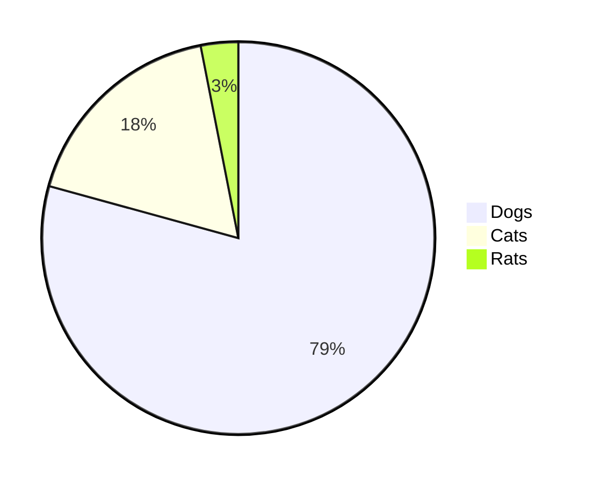

[testlink1 (fourier)]({{ site.baseurl }}/2022/12/01/my-cool-title)

[testlink2 (recoil)]({{ site.baseurl }}/2022/11/30/recoil)

[testlink3 (loremipsum)]({{ site.baseurl }}/2022/12/01/testpage2/hello)

<link rel="stylesheet" href="https://cdnjs.cloudflare.com/ajax/libs/mathquill/0.10.1/mathquill.css" integrity="sha512-vPg9GqsZZ4LHv9BkFfZSXt7y4D7YaARPU2JFmpZug4EgtJJrumytMAFZkNSk2LSyqWir0TNbh2tBq7UJIMxvlA==" crossorigin="anonymous" referrerpolicy="no-referrer" />

Type math here: 

LaTeX of what you typed: 

